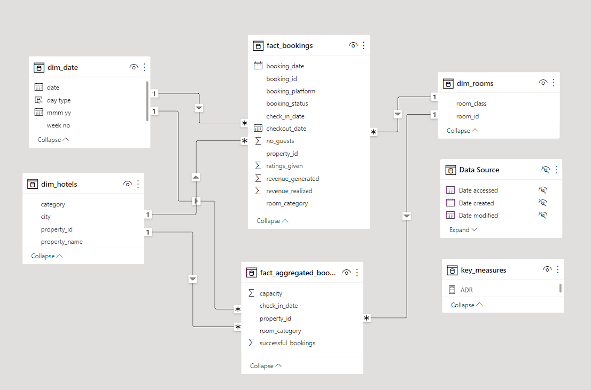
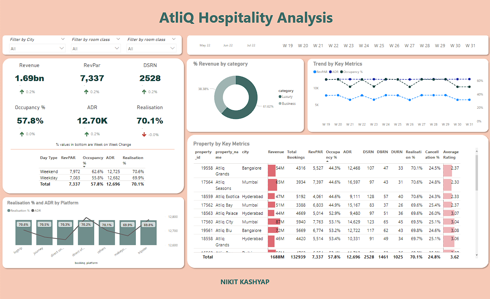

# AtliQ Hospitality Analysis - PowerBI

As part of the codebasics september month resume challenge, I have worked on this analysis project.

Link to the [Challenge](https://codebasics.io/event/codebasics-resume-project-challenge)

Link to [Interactive Dashboard](https://1drv.ms/p/s!AtEjudc6cIjagcAWVwM9iUPXBYu1Sw)

Link to [Presentation Video](https://www.linkedin.com/posts/activity-7049336402219565056-eYAR?utm_source=share&utm_medium=member_desktop)

## Problem statement

Atliq Grands is a leading hospitality company that operates several five-star hotels across India. It has been in the industry for two decades, but it faces increasing competition and declining market share and revenue in the luxury/business hotels segment. To regain its competitive edge, the managing director of Atliq Grands wants to leverage “Business and Data Intelligence” to inform strategic decisions. However, the company lacks an internal data analytics team to provide such insights.

Therefore, the revenue management team has decided to outsource the data analysis to a third-party service provider who can offer insights from their historical data.

### Task List

As a data analyst, you have been given sample data and a mock-up dashboard to complete the following task. You can access all the necessary documents from the download section.

- Calculate the metrics according to the metric list.
- Build a dashboard that matches the mock-up provided by the stakeholders.
- Generate relevant insights that go beyond the metric list/mock-up dashboard.

## Provided Mock-up Dashboard

    

## Data Model

    

## Overall Analysis View

    

## Some Important insights from the Dashboard

- Mumbai is the top revenue generator (669 M), followed by Bangalore, Hyderabad and Delhi.
- AtliQ Exotica is the best performing property type with 320 Million revenue, 3.62 rating, 57% occupancy and 24.4% cancellation rate.
- AtliQ Bay has the highest occupancy rate of 66% among all properties.
- Week 24 recorded the highest weekly revenue of 139.6 Million.
- Delhi leads in both occupancy and rating, followed by Hyderabad, Mumbai and Bangalore.
- AtliQ lost about 298 Million due to cancellations.
- Elite rooms are the most popular and also the most cancelled room type.

